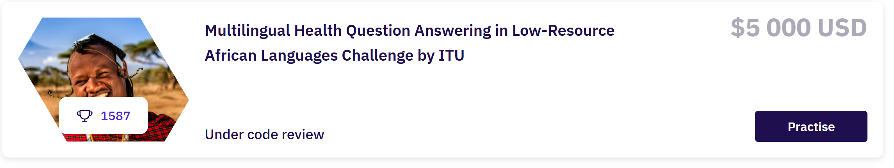

<div align="center">

# 🌍 African Health QA

**Assistant de questions-réponses médicales multilingue pour 8 langues africaines**

[](https://huggingface.co/spaces/kgueye001/african-health-qa)
[](https://huggingface.co/kgueye001/llama31-african-health-qa-lora)
[](https://huggingface.co/datasets/kgueye001/african-health-qa-data)

<br>



</div>

---

## Le projet

Une question de santé maternelle, sexuelle ou reproductive, posée dans une
langue africaine peu dotée en ressources numériques (akan, amharique,
luganda, swahili...), obtient une réponse fiable, dans la même langue,
générée par un modèle de langage spécialisé.

Ce projet a été développé dans le cadre du **challenge Zindi/ITU
"Multilingual Health Question Answering in Low-Resource African
Languages"** (doté de 5 000 $), où l'objectif était de répondre
automatiquement à des questions de santé dans 8 combinaisons
langue × pays, en s'appuyant sur un corpus d'entraînement de ~36 500
paires question-réponse.

**Score final sur le leaderboard public : 0.620** — soumission actuellement
en cours de revue de code par les organisateurs.

```
Score = 0.37 × ROUGE-1 F1  +  0.37 × ROUGE-L F1  +  0.26 × Jugement LLM
```

## Pourquoi ce projet est intéressant

Au-delà du score, ce projet illustre une chaîne complète de mise en
production d'un modèle de langage fine-tuné, du prototypage jusqu'au
déploiement public :

- **Fine-tuning LoRA** d'un LLM 8B sur un corpus multilingue restreint
- **Pipeline RAG** combinant un retriever multilingue (BGE-M3) et un
  reranker (CrossEncoder) pour ancrer les générations sur des données
  réelles
- **Stratégie de décodage adaptative par langue** — l'échantillonnage
  aide certaines langues et casse complètement la génération amharique ;
  le pipeline final route chaque langue vers la méthode qui fonctionne
  réellement pour elle
- **Quantification et déploiement gratuit** — modèle fusionné, converti
  en GGUF 4 bits, servi sur CPU via `llama.cpp` dans une démo Gradio
  accessible publiquement

## Architecture

```
Question
   │
   ▼
Embedding BGE-M3 (multilingue, 1024 dim)
   │
   ▼
Recherche FAISS (index dédié par langue)
   │
   ▼
Reranking CrossEncoder  →  top-3 contextes pertinents
   │
   ▼
Llama-3.1-8B-Instruct + LoRA (fine-tuné sur Train+Val)
   │
   ▼
Réponse dans la langue de la question
```

| Composant | Choix technique |
|---|---|
| Modèle de base | `meta-llama/Llama-3.1-8B-Instruct` |
| Fine-tuning | LoRA (r=16, α=32), SFT complet via TRL |
| Retriever | `BAAI/bge-m3` (embeddings denses multilingues) |
| Reranker | `cross-encoder/mmarco-mMiniLMv2-L12-H384-v1` |
| Décodage | Greedy déterministe pour l'amharique ; échantillonnage (n=3) + sélection CrossEncoder pour les autres langues |
| Déploiement | GGUF Q4_K_M (4,9 Go), inférence CPU via `llama-cpp-python` |

## Résultats

Progression du score au fil des itérations (détails complets dans
[`results/journal_soumissions.md`](results/journal_soumissions.md)) :

| Étape | Score LB |
|---|---|
| Premier modèle (mT0-XXL + reranking TF-IDF) | 0.497 |
| Llama-3.1-8B + LoRA + reranking FAISS | 0.606 |
| + retriever BGE-M3, contextes enrichis | 0.613 |
| + décodage adaptatif par langue (version finale) | **0.620** |

Documentation technique complète (corrections critiques, pistes
abandonnées, choix d'architecture) : [`docs/RAPPORT_TECHNIQUE.md`](docs/RAPPORT_TECHNIQUE.md)

## Démo en ligne

Une interface Gradio est déployée gratuitement sur HuggingFace Spaces,
affichant la réponse générée ainsi que les contextes récupérés par le
système RAG : **[huggingface.co/spaces/kgueye001/african-health-qa](https://huggingface.co/spaces/kgueye001/african-health-qa)**

## Structure du dépôt

```
.
├── notebooks/          scripts d'entraînement et d'inférence
├── scripts/
│   ├── merge_lora_model.py     fusion de l'adaptateur LoRA dans le modèle de base
│   ├── convert_to_gguf.py      quantification GGUF Q4_K_M
│   └── deploy/app.py           application Gradio (HuggingFace Space)
├── results/
│   └── journal_soumissions.md  historique complet des 18 soumissions
├── docs/
│   └── RAPPORT_TECHNIQUE.md    rapport technique détaillé
└── requirements.txt
```

## Modèles et données

- Adaptateur LoRA : [kgueye001/llama31-african-health-qa-lora](https://huggingface.co/kgueye001/llama31-african-health-qa-lora)
- Modèle quantisé GGUF : [kgueye001/llama31-african-health-qa-gguf](https://huggingface.co/kgueye001/llama31-african-health-qa-gguf)
- Données d'entraînement : [kgueye001/african-health-qa-data](https://huggingface.co/datasets/kgueye001/african-health-qa-data)

## Compétition

[Multilingual Health Question Answering in Low-Resource African Languages](https://zindi.africa/) — challenge organisé par l'**ITU** (International Telecommunication Union) sur la plateforme Zindi, doté de 5 000 $.
Langues couvertes : akan (Ghana), amharique (Éthiopie), anglais (Éthiopie, Ghana, Kenya, Ouganda), luganda (Ouganda), swahili (Kenya).
